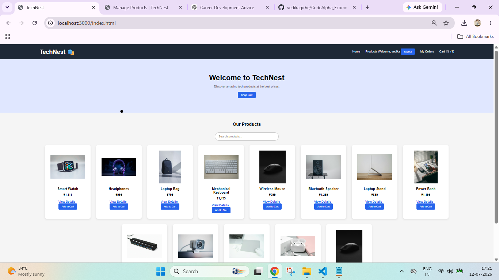
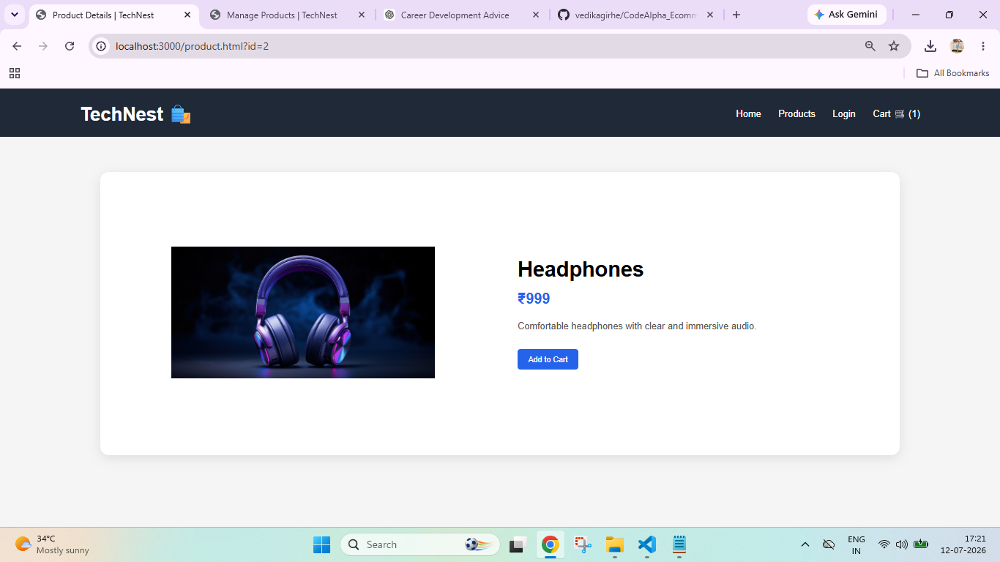
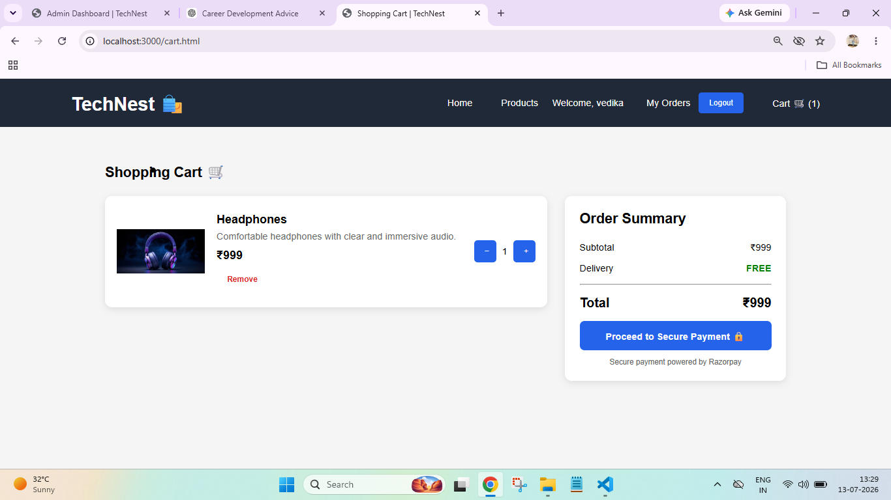
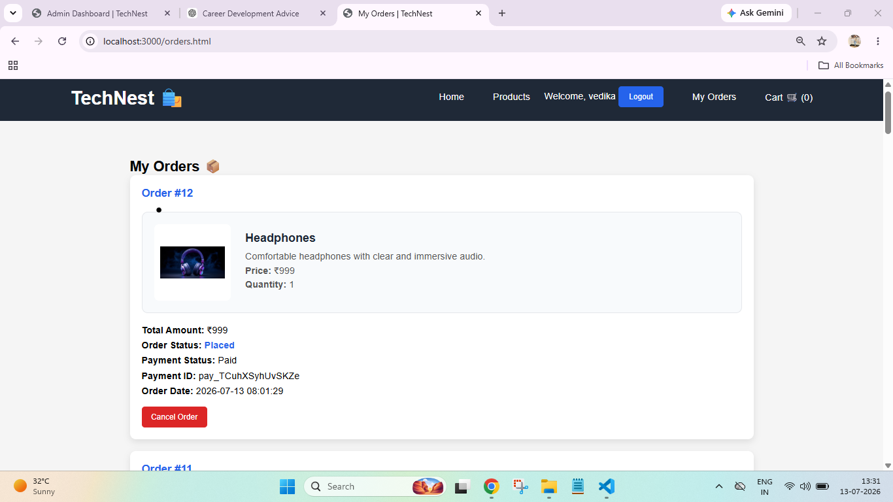
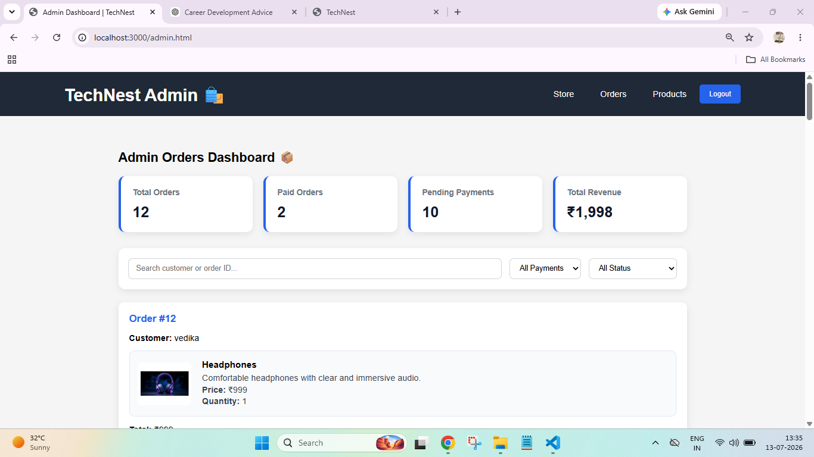
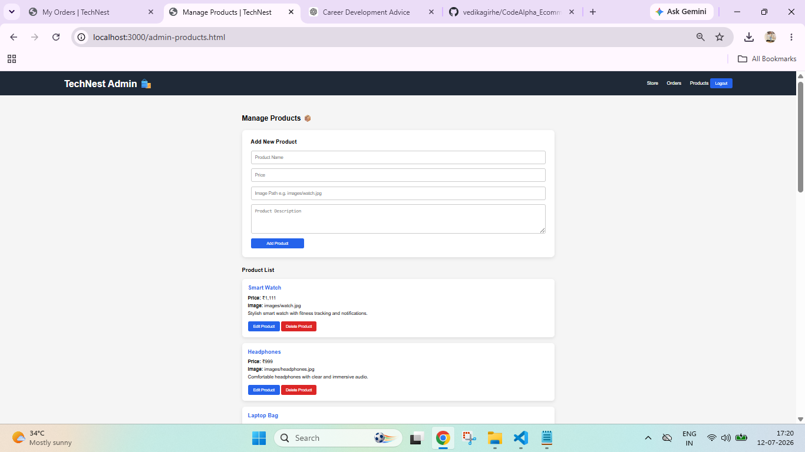
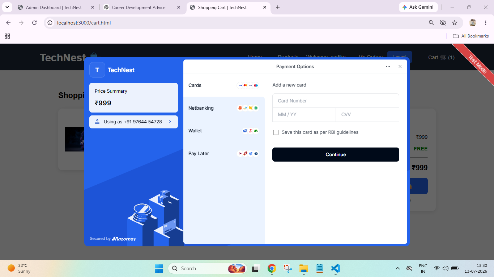

# TechNest 🛍️

TechNest is a full-stack e-commerce web application developed as part of the CodeAlpha internship program.

The application allows users to browse technology products, create an account, log in, manage a shopping cart, place orders, track order status, cancel orders, and request product returns.

## Features

### User Features
- User Registration
- Secure Login
- Password Hashing using bcrypt
- Browse Products
- Search Products
- Product Details Page
- Add to Cart
- Quantity Management
- Place Orders
- View Order History
- Track Order Status
- Cancel Orders
- 7-Day Return Policy
- Razorpay Payment Integration
- Secure Payment Verification
- Payment Status Tracking
- Payment ID Storage
- Responsive Shopping Cart
- Order Summary

### Admin Features
- Secure Admin Login
- Admin Session Protection
- View Customer Orders
- Update Order Status
- Manage Return Requests
- Add Products
- Edit Products
- Delete Products
- Admin Dashboard Statistics
- Total Orders Overview
- Paid Orders Tracking
- Pending Payment Tracking
- Total Revenue Overview
- Search Orders by Customer
- Filter Orders by Payment Status
- Filter Orders by Order Status
- View Product Images and Details

## Technologies Used
- HTML5
- CSS3
- JavaScript
- Node.js
- Express.js
- SQLite
- Better SQLite3
- bcrypt.js
- Express Session
- Razorpay Payment Gateway
- dotenv
- Node.js Crypto Module

## Project Structure

    CodeAlpha_EcommerceStore/
    │
    ├── public/
    │   ├── images/
    │   ├── index.html
    │   ├── login.html
    │   ├── register.html
    │   ├── cart.html
    │   ├── product.html
    │   ├── orders.html
    │   ├── admin-login.html
    │   ├── admin.html
    │   ├── admin-products.html
    │   ├── script.js
    │   └── style.css
    │
    ├── database.js
    ├── server.js
    ├── package.json
    └── README.md

## Installation

1. Clone the repository.

2. Install dependencies:

       npm install

3. Start the server:

       node server.js

4. Open the application in the browser:

       http://localhost:3000

## Return Policy

Customers can request a return only after an order has been delivered.

The return request must be submitted within 7 days from the delivery date.

The administrator can review the return request and update the order status to Returned.

## Security

- User passwords are hashed using bcrypt.
- Admin routes are protected using server-side sessions.
- Admin authentication is required for product and order management.

## Payment Integration

TechNest integrates Razorpay for secure online payments.

- Razorpay Checkout integration
- Server-side payment signature verification
- Payment status tracking
- Razorpay Payment ID storage
- Orders are created after successful payment verification
- Secure payment processing using environment variables

## Internship

This project was developed as part of the CodeAlpha Web Development Internship.

## Project Screenshots

### Home Page

### Product Details

### Shopping Cart

### My Orders

### Admin Orders Dashboard

### Admin Product Management

### Razorpay Payment

## Author

Vedika Girhe